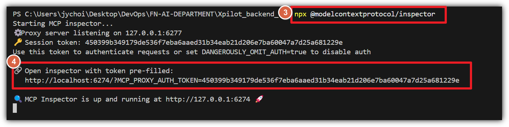
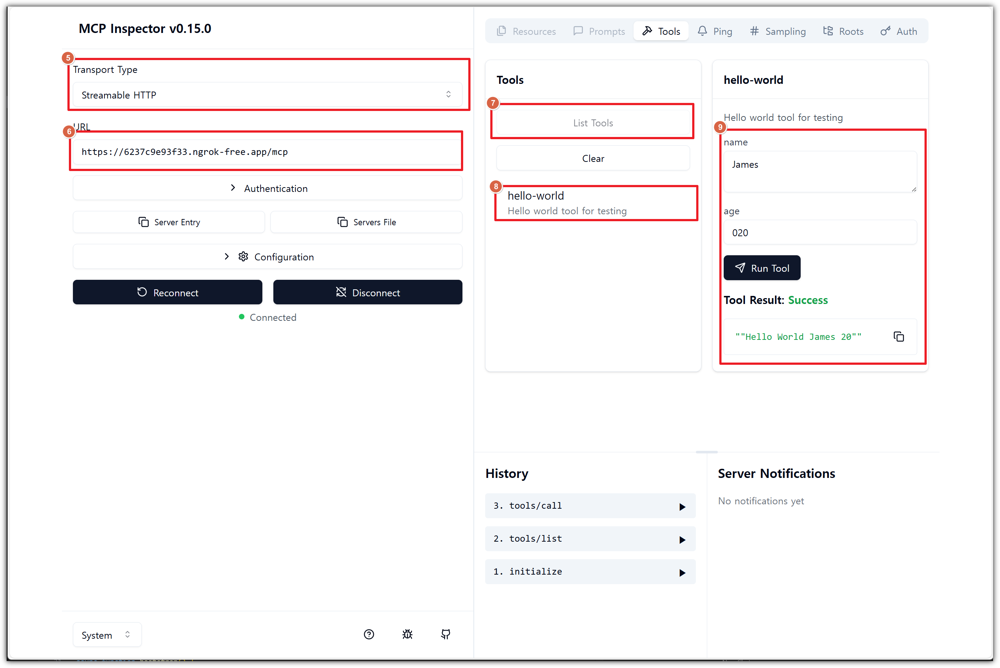

<p align="center">
  <a href="http://nestjs.com/" target="blank"></a>
</p>

<h1 align="center">Custom Extension – 개발 키트 가이드</h1>
<p align="center">로컬에서 MCP 서버를 빠르게 구동하고 테스트하기 위한 안내서</p>

## 목차

### 1. 사전 요구사항

### 2. 로컬모드로 개발 킷 구동 방법

### 3. 테스트 방법

### 4. Custom Logic 구현

---

## 1. 사전 요구 사항

1. Node.JS 20 이상 설치

## 2. 로컬모드로 개발 킷 구동 방법

1. [ngrok 공식 사이트](https://ngrok.com/) 이동
2. 회원 가입 or 로그인
3. 로그인 후 대시보드에서 Authtoken 복사
<p align="center">
  
  <br /><em>스크린샷 - 콘솔에 표시된 Inspector 접속 URL</em>
</p>

4. `config.json`에 `NGROK_ACCESS_KEY`에 토큰 값 입력
5. 만약에 `MODE`가 `local`이 아니고 `prod`면 `NGROK_ACCESS_KEY` 값 없어도 됨
6. 의존성 설치

```bash
npm install
```

7. 앱 구동

```bash
npm run start:dev
```

8. 콘솔창에 나오는 URL을 통해 어느 네트워크에서든 MCP 서버 접속 가능

> 참고: 실제 서비스 모드(`prod`)에서는 ngrok 토큰 없이 자체 인프라 URL을 사용할 수 있습니다.

## 3. 테스트 방법

1. MCP Inspector 실행

```bash
npx @modelcontextprotocol/inspector
```

2. 콘솔에 안내된 URL이 나오면 해당 URL 열기
<p align="center">
  
  <br /><em>스크린샷 - 콘솔에 표시된 Inspector 접속 URL</em>
</p>

3. MCP Inspector 페이지에서 서버 MCP 서버 외부 URL을 입력하고 끝에 `/mcp` 경로를 추가
4. `Connect` 버튼을 눌러 연결 후 툴 테스트
<p align="center">
  
  <br /><em>스크린샷 - MCP Inspector에서 URL 입력 후 툴 테스트</em>
</p>

## 4. Custom Logic 구현

1. `src\service\app.service.ts` 경로에서 커스텀 로직 구현
2. `tool` 추가를 원할 경우, `@McpTool(...)` 데코레이터를 이용해서 메소드 구현
3. 메소드 구현 시, `sanitizeHttpHeader()` 함수를 이용해서 불필요한 header를 제거해서 사용하기를 권장

```ts
// Hello World 출력
@McpTool({
    name: "hello-world",
    description: HelloWorldDescription,
    parameters: HelloWorldParameterSchema,
})
async hello_world(
    param: HelloWorldParameterSchema,
    context: McpContext,
    request: ExpressRequest,
) {
    // 불필요한 헤더 제거
    sanitizeHttpHeader(request);

    // 로직
    return `Hello World ${param.name} ${param.age}`;
}
```
